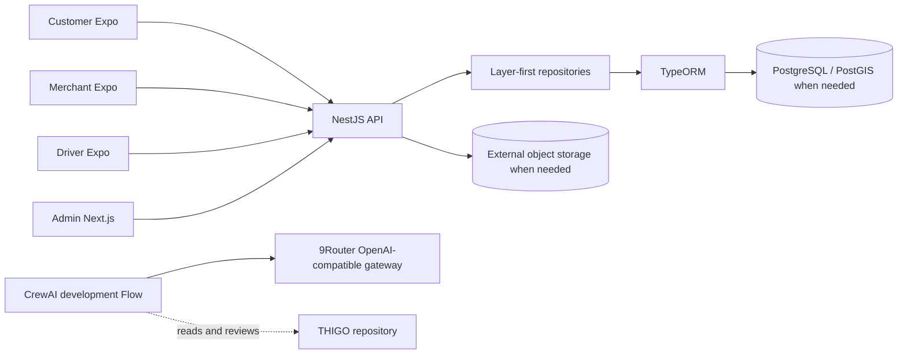

# THIGO Architecture

## Overview

THIGO is a pnpm/Turborepo monorepo. Three Expo clients and the Next.js admin communicate with one stateless NestJS API. PostgreSQL is the relational source of truth; managed services such as Supabase are infrastructure, not the business backend. Python CrewAI tooling is isolated under `.ai` and is never required to run the product.

## Monorepo map

| Path                         | Responsibility                                    |
| ---------------------------- | ------------------------------------------------- |
| `apps/mobile/customer`       | Customer Expo deployment                          |
| `apps/mobile/merchant`       | Merchant Expo deployment                          |
| `apps/mobile/driver`         | Driver Expo deployment                            |
| `apps/admin-web`             | Admin Next.js deployment                          |
| `apps/api`                   | NestJS API and all server-side business authority |
| `packages/typescript-config` | Shared strict TypeScript policy                   |
| `.ai/crew`                   | Isolated CrewAI Python project                    |
| `.ai/prompts`                | Versioned AI prompt material                      |
| `.ai/reports`                | Generated, gitignored AI reports                  |

## Technology choices

- Node.js 24.15+, pnpm 11, Turborepo 2, TypeScript 6.
- Expo SDK 57 / React Native 0.86 for all mobile apps.
- Next.js 16 for admin; it is a UI, not a second backend.
- NestJS 12 as one API application. No Nest-managed repository monorepo and no microservices.
- PostgreSQL through TypeORM and the official NestJS integration. PostGIS may be added through a migration when a geospatial requirement arrives.
- CrewAI 1.x Flow with a Claude Lead and GPT Assistant through 9Router's OpenAI-compatible endpoint.

## Backend dependency direction

`Controller -> Service -> Repository -> Database`

Controllers own transport, validation/input mapping, and authorization boundaries. Services own business decisions, orchestration, and transactions. Repositories own persistence only. Entities represent persisted/domain data as appropriate. Modules wire dependencies. Gateways own server-mediated realtime or external transport integrations. Controllers never call repositories or databases directly.

## Frontend dependency philosophy

Routes/screens compose navigation and views; components render UI; services call the API; stores hold client state; hooks provide reusable UI/application orchestration. Server-side business rules remain authoritative in the API. Each app is independently deployable, apps never import one another, and shared code is extracted only after real duplication proves a stable boundary.

## Database boundary

The only permitted business-data path is `Mobile/Admin -> NestJS API -> Repository -> TypeORM -> PostgreSQL`. No frontend-to-Supabase/PostgreSQL access and no coupling to Supabase Realtime. `DATABASE_URL` is provider-neutral and may target local PostgreSQL, Supabase-managed PostgreSQL, or another compatible provider. TypeORM schema synchronization and automatic migration execution are disabled; every schema change must be reproducible through migrations in `apps/api/src/migrations`. Pooling provider and product schema remain intentionally undecided. PostGIS may be enabled by a future migration when geospatial features require it.

## AI architecture

CrewAI is development-only. The full task Flow sequences Inspect -> Plan -> Implement -> Review -> Verify -> Report using a Claude Lead and GPT Assistant. The separate smoke Flow makes one fixed acknowledgement call through each required 9Router combo, verifies both responses deterministically, and does not load repository context, expose tools, or write a report. One configuration module maps `NINEROUTER_API_KEY` and the optional `NINEROUTER_BASE_URL` override into CrewAI's custom OpenAI-compatible client. Repository code names only the `thigo-implement` and `thigo-reviewer` combos; upstream provider/model selection and fallback remain in 9Router. Product startup never depends on 9Router.

## Immutable and evolvable decisions

Owner approval is required to change: monorepo model, TypeScript product stack, Expo/Next.js/NestJS strategies, layered backend direction, backend-mediated data access, TypeORM persistence strategy, PostgreSQL source of truth, no-microservices stance, AI governance, or major dependency direction.

Evolvable without architecture approval: features, domain modules, tables, columns, indexes, relationships, endpoints, screens, states, roles, permissions, workflows, realtime use cases, caching, and business rules. These still require normal review and tests.

## Where does this code belong?

| Code                                           | Location                                                        |
| ---------------------------------------------- | --------------------------------------------------------------- |
| HTTP validation or response mapping            | `apps/api/src/controllers/<feature>` and `dto/<feature>`        |
| Business decision or transaction orchestration | `apps/api/src/services/<feature>`                               |
| Database query or persistence mapping          | `apps/api/src/repositories/<feature>`                           |
| TypeORM connection configuration               | `apps/api/src/config/database.ts`                               |
| Reproducible database schema change            | `apps/api/src/migrations`                                       |
| Nest dependency wiring                         | `apps/api/src/modules`                                          |
| Server-mediated realtime transport             | `apps/api/src/gateways`                                         |
| Mobile route/screen composition                | `apps/mobile/<app>/src/screens` or future Expo Router `app`     |
| Mobile/admin API call                          | That app's `src/services/<feature>`                             |
| Reusable UI inside one app                     | That app's `src/components/<feature>`                           |
| Admin route                                    | `apps/admin-web/src/app`                                        |
| Stable cross-app library with real consumers   | A narrowly named package under `packages` with explicit exports |
| Crew/Flow/configuration                        | `.ai/crew`                                                      |
| Cross-cutting architecture decision            | `docs/DECISIONS.md`                                             |
